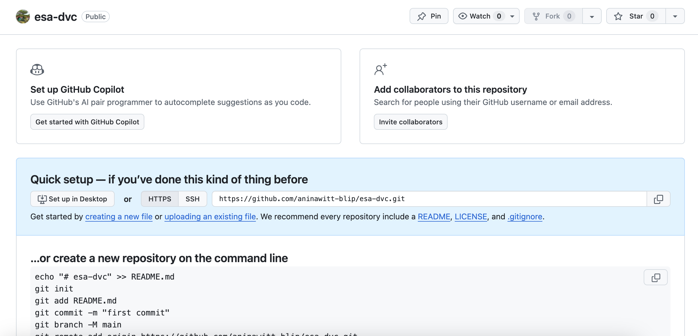
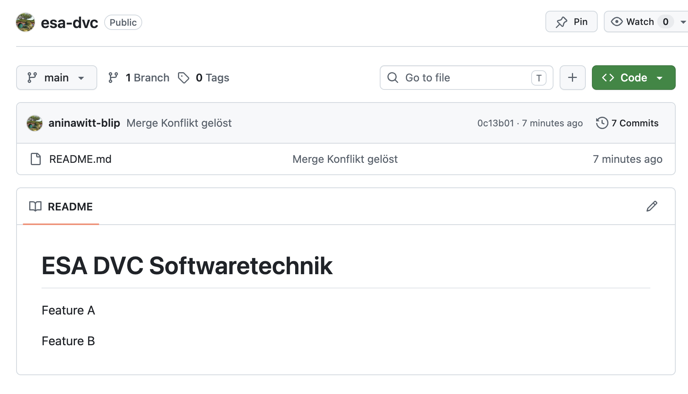
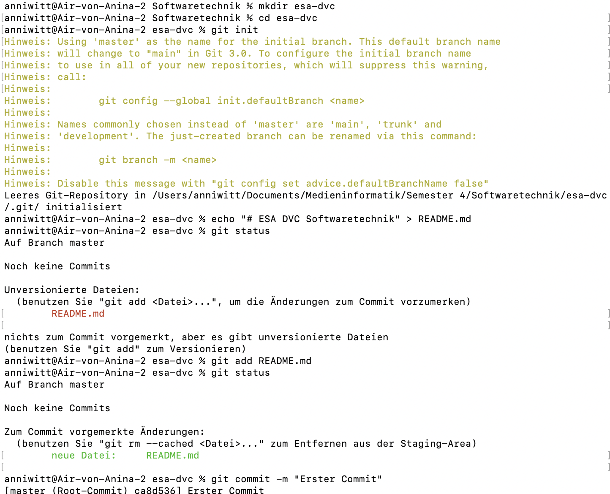
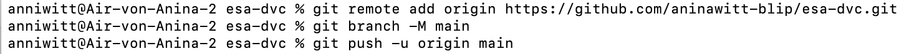
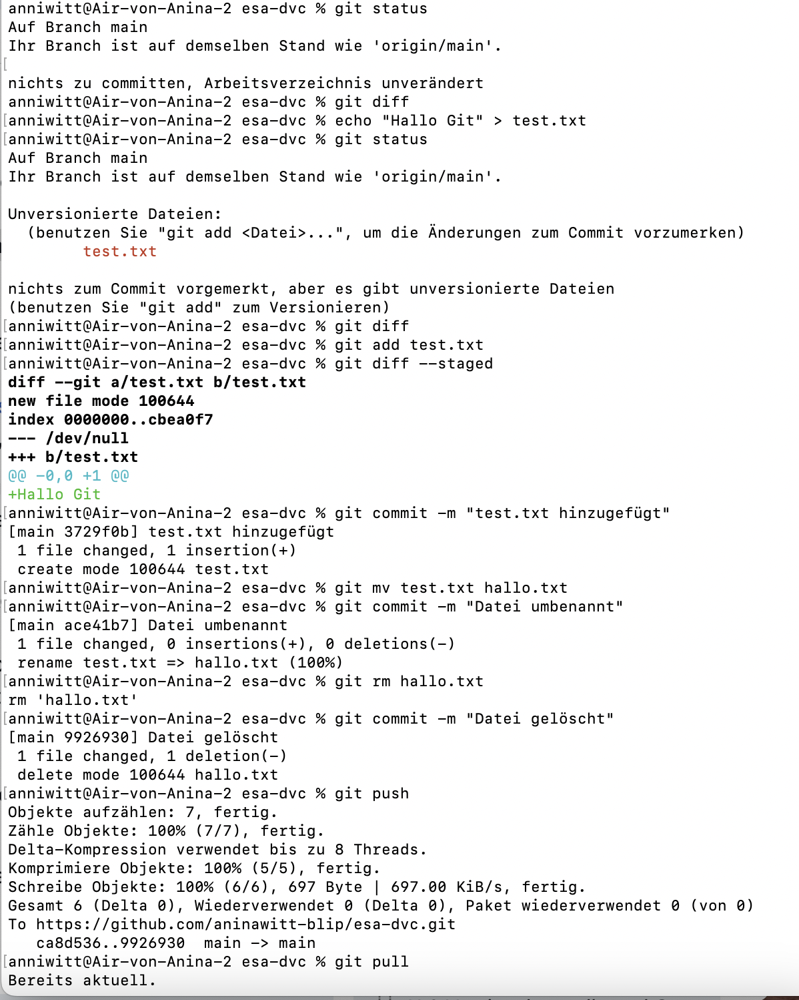
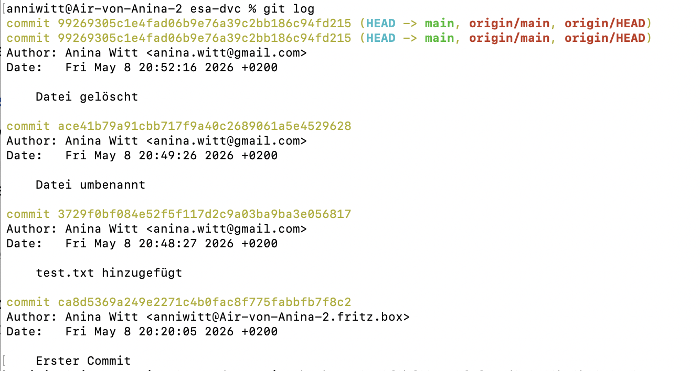
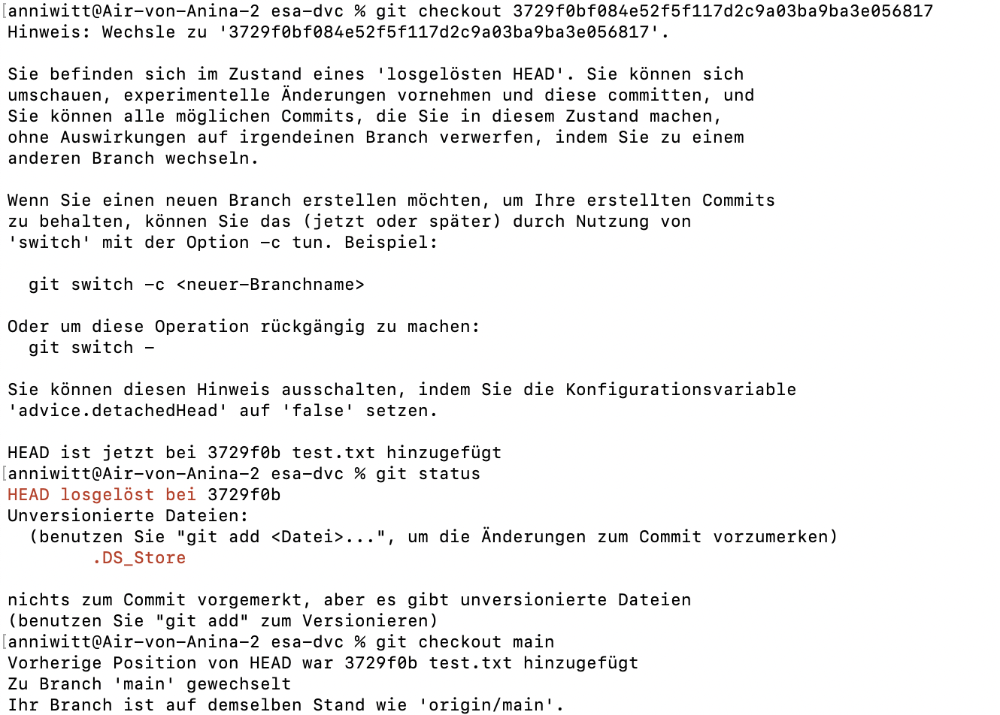
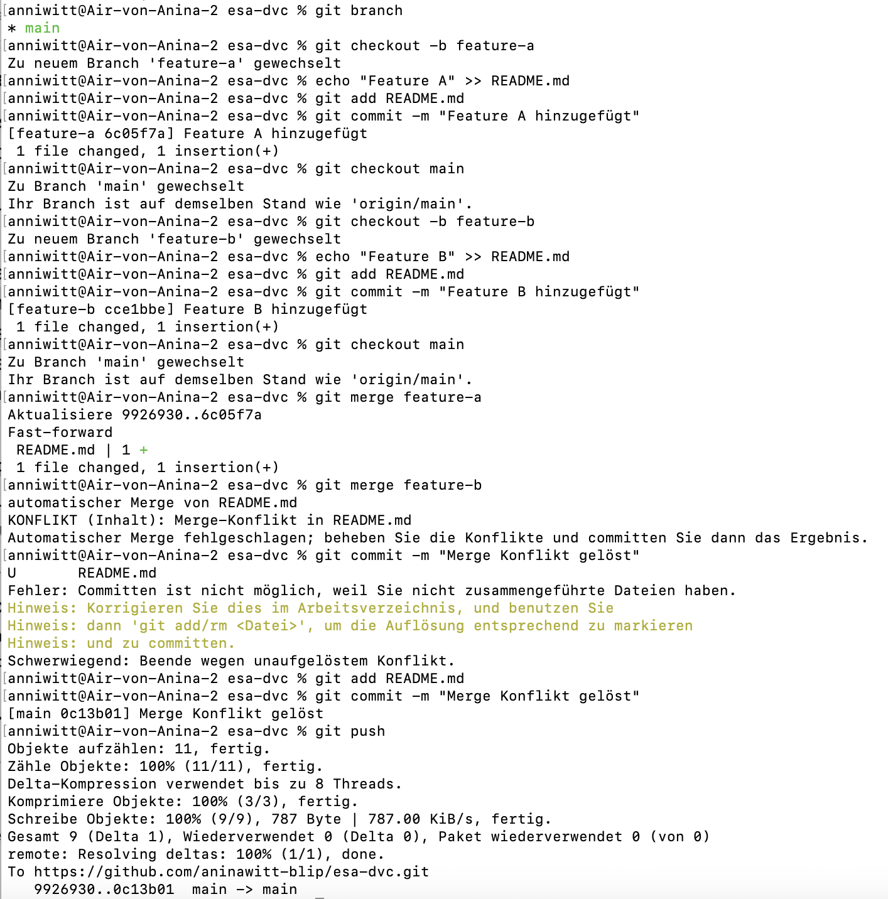

# ESA DVC Softwaretechnik

Feature A

Feature B

## 1. Erstellen Sie sich ein Repository in Github oder GitLab.

## 2. Pushen Sie ein eigenes Projekt von Ihnen hoch (z. B. das CCD-Projekt) oder erstellen Sie ein neues Projekt!

## 3. Wenden Sie alle in der Lerneinheit genannten relevanten Methoden beweisbar an: (das Github Repo ist Beweis) push, pull, add, commit, diff, status, rm/mv, etc.

## 4. Experimentieren Sie mit Zeitreisen!

## 5. Erstellen Sie zwei unterschiedliche aber ähnliche Branches, wechseln Sie hin und her und mergen sie diese Branches dann wieder!

## 6. Erstellen Sie in GitHub einen Pull-Request bezugnehmend auf https://github.com/edlich/education! (was kleines, nützliches, witziges, etc., aber nicht via Shell, sondern via GitHub click!)
Pull-Request Create VeganBrownies.md #599

